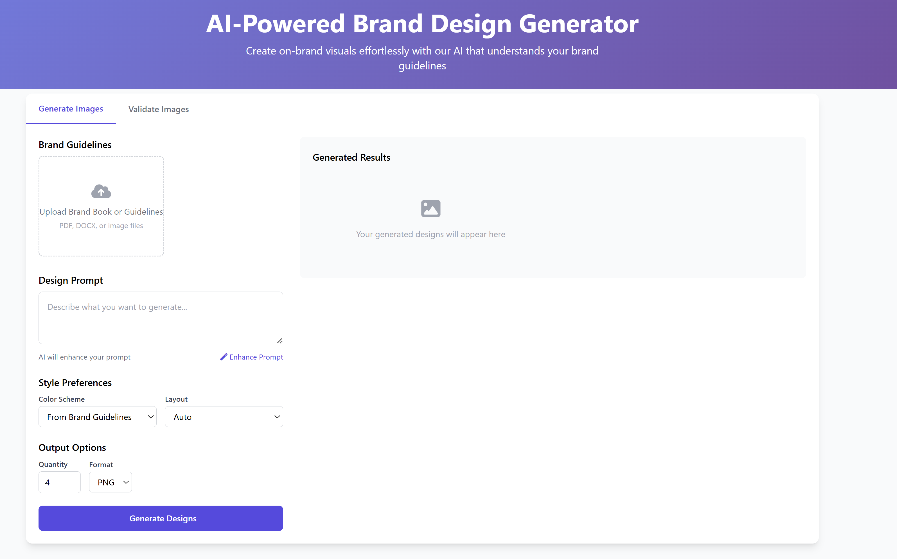

# Процесс разработки ML-проекта "Сервис генерации изображений для дизайнеров"

## 1. Бизнес-анализ (Business Understanding)

### Цели и скоуп проекта

**Организационная структура:**
- Участники проекта со стороны заказчика: явного заказчика нет
- Основные пользователи: пользователи занимающиеся созданием графического контента - графические дизайнеры, маркетологи, иллюстраторы, художники.
- Контакты: Отсутствуют
- Рабочие чаты: Отсутствуют

**Бизнес-цель проекта:**
Ускорение процесса подготовки графических материалов при соблюдении визуальной политики и бренд-буков. 

**Существующие решения:**
- Существуют ли уже разработанные решения? Скорее нет, чем да
- Если да, то какие: Canva, Adobe Illustrator, Photoshop, Figma (с плагинами)
- Чем именно текущее решение не устраивает: отсутствуют сквозные инструменты позволяющие одновременно генерировать изображения и соблюдать все требования к визуальной политике и бренд-букам. Дизайнер должен делать это самостоятельно, подбирать инструменты, модели, думать над промптом для усиления. Дополнительные ограничения вводят также санкции.

### 1.1 Текущая ситуация (Assessing current solution)

**Ресурсы:**
- Доступное железо: есть как локальное железо (4070, 4090), так и платные облачные ресурсы (GPU не всех классов могут быть доступны в определенный момент)
- Необходимость закупки оборудования: нет

**Данные:**
- Где и как хранятся данные: Данные связанные с разработкой будут хранится локально.
- Доступ к системам: Есть доступ к основным генеративным моделям: Stable Diffusion, Midjourney, FLUX по API. Также есть доступ к LLM (OpenAI, Claude, Qwen) через API.
- Необходимость докупки/сбора внешних данных: нет

**Экспертиза:**
- Возможность выделения экспертов заказчиком: явного заказчика нет, но есть доступ к эксперту - графическому дизайнеру.

**Риски проекта:**
1. Сроки: риск присутствует. Данным риском можно управлять за счет контроля скоупа разработки. Например отказаться от полноценной фронтенд части или сделать его упрощенным. 
2. Данные: как таковых входных данных нет. Основной спектр работ будет вестись с созданием набора оптимальных промптов для генеративных моделей и определением ролей моделей. Риск может быть связан с тем, что данные могут быть не всегда оптимальными для генерации нужного контента. Этим риском можно управлять за счет техник промпт-инженеринга. 
3. Закономерности: так как входных данных нет, то и риска отсутствия закономерностей тоже нет.
4. Другие риски: появление совершенных моделей, который смогут все это делать самостоятельно без нашего вмешательства. Непосредственно управлять этим риском невозможно, нельзя остановить прогресс. Однако можно адаптировать проект под новые требования с новыми моделями, повышать удобство использования и повышая уровень качества генерации контента.

### 1.2 Решаемые задачи с точки зрения аналитики (Data Mining goals)

**Техническая постановка:**
Данный проект является нестандартным с точки зрения классического ML. Результатом генерации являются изображения. Принятие решение о том, что дизайнер получит то что ожидал, является субъективным фактором - изображение может просто не понравится. Решить данную проблему можно с помощью организации циклов генерации, когда пользователь с помощью промптов пытается догенерировать то, что не понравилось. Также пользователь может выставлять свою оценку, для того, чтобы в ретроспективе улучшить подходы/промпты. 
Есть однако еще один фактор. Важным отличием проекта от простого сервиса генерации является следование визуальной политике и брендбукам. Учитывая текущее состояние развития LLM можно сделать гипотезу, что использование мультимодальной LLM позволит оценить качество генерации с точки зрения политик и правил. Итог генерации будут оценивать несколько моделей, каждая из которых будет рассматривать свой аспект визуальной политики. С помощью этих же моделей будет оцениваться качество используемых промптов в ходе разработки проекта. Помимо таких моделей могут использоваться, также алгоритмические модули оценивающие изображения, например распределение цветов. Исходя из этой гипотезы тип решаемой задачи будет классификация. 

**Метрики оценки:**
- Выбранная метрика: итоговая метрика строится на основе отдельных оценок набора LLM моделей и алгоритмических модулей. Итоговая оценка должна быть в диапазоне от 0 до 1 и по сути является Accuracy. То есть насколько точно изображение соответствует установленном брендбуку и правилам. 
- Критерий успешности модели: 0.6 - минимальный порог, 0.75 - оптимальный порог.

**Альтернативные методы оценки:**
- Если объективный критерий качества использовать не будем, то как будут оцениваться результаты: дополнительно можно использовать оценки эксперта, тем самым проверять также качество оценки результатом генерации и следования правилам брендбука.

### 1.3 План проекта (Project Plan)

1. Бизнес анализ - 1 неделя
2. Анализ данных - 2 недели
3. Подготовка данных - 2 недели
4. Моделирование - 2 недели
5. Оценка результатов - 1 неделя
6. Внедрение - 2 недели

## 2. Прототип продукта

### 2.1 Описание продукта
Продукт - веб-сервис генерации изображений для дизайнеров, который использует искусственный интеллект для создания графических материалов в соответствии с визуальной политикой и бренд-буками. Он направлен на автоматизацию процесса дизайна с использованием комбинации моделей генерации изображений и мультимодальных LLM. Пользователь загружает входные данные - брендбук, требования к фирменному стилю, а также промпт того, что должно быть изображено. После начала генерации сервис делает следующее:
- улучшает исходный промпт;
- достает неструктурированную информацию из брендбуков и гайдбуков;
- генерирует изображения;
- оценивает полученный результат с точки зрения установленных правил и если он ниже установленного порога, то генерирует новый вариант пытаясь доработать промпт;
- предоставляет пользователю несколько вариантов изображений, которые можно выбрать или отредактировать.

Альтернативно можно использовать только валидатор для автоматической проверки изображений на предмет их соответствия брендбукам и гайдлайном. В таком случае пользователь загружает набор изображений для проверки и запускает валидатор.

### 2.2 Целевой пользователь
Основными целевыми пользователями являются графические дизайнеры, которым требуется быстро создавать визуальный контент, соответствующий определенным стилистическим требованиям и фирменному стилю. У этих пользователей будут повышенные требования к качеству генерации и контролю управления этим процессом. 
Дополнительной целевой аудиторией могут быть маркетологи, HR, DevRel, которые захотят намного более простое управление процессом генерации.
Это могут быть как частные лица, так и корпоративные клиенты (например, если сервис используют штатные дизайнеры в компании).

### 2.3 Ценность продукта
Продукт предоставляет пользователям возможность ускорить процесс создания графических материалов или их макетов, автоматически соблюдая все требования визуальной политики и бренд-буков, что сокращает время на разработку и уменьшает риск нарушения корпоративных стандартов. Сервис анализирует цвета, шрифты и композиционные правила из загруженных бренд-буков с помощью мультимодальных LLM, а затем корректирует промпты для генерации, чтобы избежать нарушений.   

### 2.4 Взаимодействие пользователя с продуктом
Пользователи взаимодействуют с сервисом через веб-интерфейс, где они могут задать параметры генерации изображений, загрузить бренд-бук или выбрать предустановленные стили, просмотреть сгенерированные варианты и скачать результаты. Система также предлагает возможность редактирования промптов для корректировки результатов и сохранения удачных настроек для будущего использования. Альтернативным вариантом также может быть использование Telegram ботов для взаимодействия с сервисом. Для повышения удобства использования и повышения вовлеченности пользователей необходима интеграция с Figma.

### 2.5 Привлечение пользователей
Для привлечения пользователей можно использовать тематические сообщества дизайнеров, специализированные профессиональные форумы, партнерства с графическими студиями и образовательными учреждениями в сфере дизайна. 
Маркетинговая стратегия включает 
- демонстрацию кейсов успешного применения, например: 
    __«Студия X сократила время на правки макетов на 40% благодаря автоматической проверке логотипов и цветовой политики.__
- бесплатный доступ для студентов дизайнерских вузов;
- бесплатный пробный период и программу раннего доступа для лидеров мнений.

### 2.6 Бизнес-модель
Бизнес-модель основана на подписке разных уровней - SaaS (Software as a Service). 
Базовый тариф предлагает ограниченное количество генераций в месяц и стандартные стили. 
Профессиональный тариф включает расширенное количество генераций, возможность загрузки собственных бренд-буков, приоритетный доступ к вычислительным ресурсам, а также иметь возможность оказывать влияние на рабочий цикл улучшения изображения.
Корпоративный тариф предусматривает интеграцию с существующими системами дизайна компании, API доступ и выделенную техническую поддержку. 

### 2.7 Продуктовое позиционирование
Мы, компания X,
помогаем графическим дизайнерам, маркетологам, HR и DevRel
в ситуации, когда требуется быстро создавать визуальный контент, соответствующий определенным стилистическим требованиям и фирменному стилю
решать проблему автоматизации процесса дизайна и соблюдения визуальной политики
с помощью технологии генерации изображений на основе искусственного интеллекта
и получать ценность в виде сокращения времени на разработку и уменьшения риска нарушения корпоративных стандартов.
